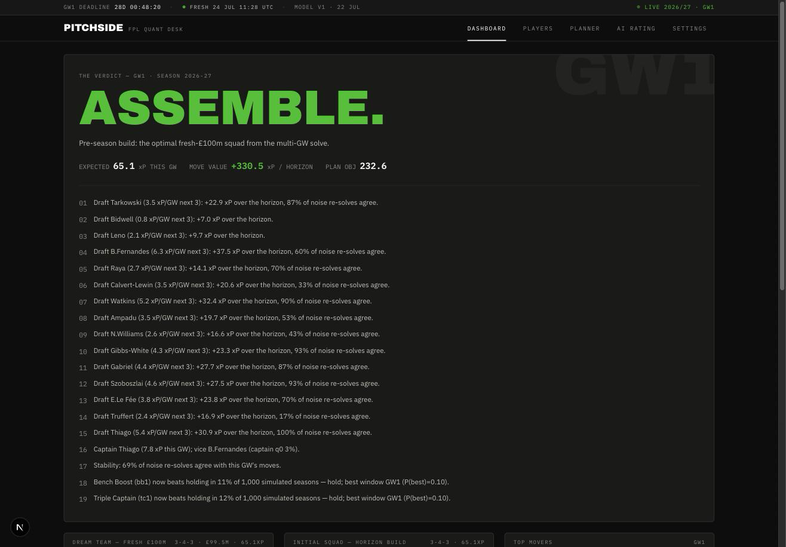
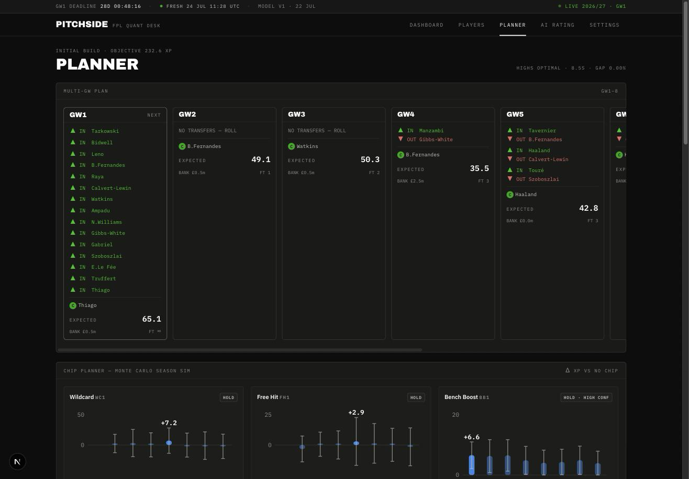
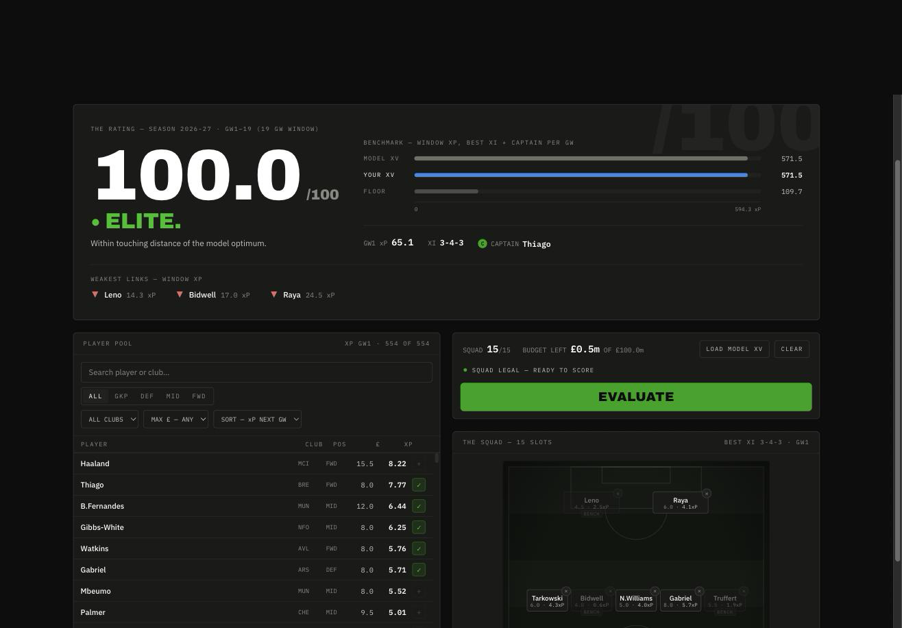
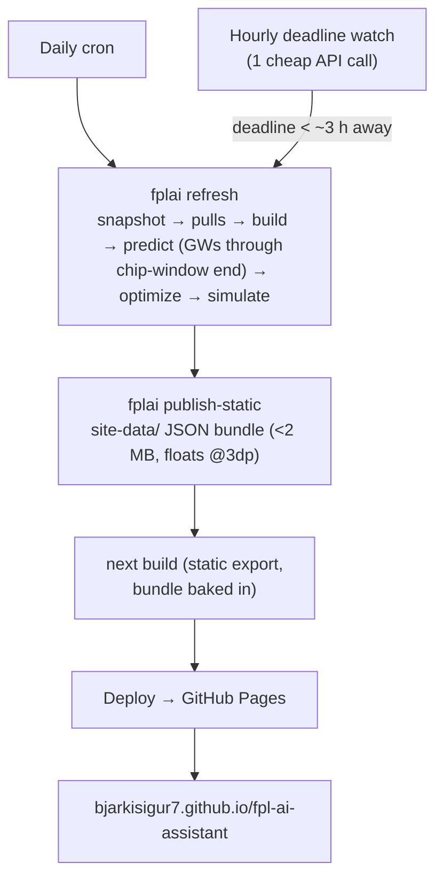

# PITCHSIDE

[](LICENSE)

**An open-source Fantasy Premier League brain, published as a free static site.**
PITCHSIDE predicts expected points for every player in the 2026-27 game with a
decomposed probabilistic model (minutes × attacking returns × clean sheets ×
bonus × …), solves the best legal £100m squad with a multi-gameweek MILP, prices
every chip week with a 1,000-rollout Monte Carlo season simulation, and serves
the whole thing as a dashboard rebuilt daily by GitHub Actions — no server, no
subscription, no tracking. Live at
**[bjarkisigur7.github.io/fpl-ai-assistant](https://bjarkisigur7.github.io/fpl-ai-assistant)**.

<!-- MAINTAINER: drop screenshots into docs/screenshots/ and these render. -->




> **Unofficial tool.** PITCHSIDE is a fan-made project. It is not affiliated
> with, endorsed by, or connected to the Premier League, the official Fantasy
> Premier League game, or any football club.

## The receipts

All numbers below come from this repo's own verification logs
([docs/STATUS.md](docs/STATUS.md)) and the benchmark spec
([docs/MODEL_DESIGN_INPUTS.md](docs/MODEL_DESIGN_INPUTS.md) §6). The public
accuracy bar is **OpenFPL**
([arXiv:2508.09992](https://arxiv.org/abs/2508.09992)), whose published
weakness is the *Zeros* category — predicting who won't play. That is exactly
where our dedicated minutes model earns its keep.

**Walk-forward xP accuracy** (ours: train < GW30, evaluate GWs 30-38 of
2025-26; OpenFPL's published numbers: prospective GW32-38 of 2024-25 — adjacent
windows, not a strict head-to-head), RMSE / MAE by return category:

| Category | PITCHSIDE | OpenFPL (published) |
|---|---|---|
| Zeros (0 pts) | **0.798 / 0.318** | 0.818 / 0.427 |
| Blanks (≤2) | 1.464 / 1.109 | **1.291 / 0.749** |
| Tickers (3-4) | 1.554 / 1.269 | **1.517 / 1.127** |
| Haulers (≥5) | 5.368 / 4.543 | **5.142 / 4.317** |

We beat OpenFPL decisively on Zeros (the minutes problem — the category OpenFPL
itself flags as its loss to commercial models), roughly match it on Tickers and
Haulers (hauler RMSE ≈ 5 for everyone; hauls are irreducible variance), and
Blanks remain our weakest category — tracked openly in
[docs/STATUS.md](docs/STATUS.md). Within-GW Spearman rank correlation: 0.726.
The model beats the last-5-average baseline in every category on identical rows.

**Policy backtest** (full weekly re-solve, GWs 33-35 of 2025-26): the model
policy scored **249 points** vs **223** for a last-5-average baseline using the
same solver and **187** for set-and-forget. (Coarse pretrained mode; the harness
itself flags that model artifacts overlapped this window — see STATUS.md for
the honest-mode command.)

**Team model**: Dixon-Coles with bookmaker-odds blending, 1X2 log-loss within
**0.011** of de-margined closing odds on the 2025-26 holdout — so for fixtures
where bookmakers haven't posted a market yet, the pure model that fills in is
nearly as sharp as the market itself.

## Architecture in five lines

```
data/       10 seasons of per-GW FPL history + xG (Understat) + odds + Elo, snapshotted daily
models/     minutes (LightGBM buckets) · team (Dixon-Coles + odds blend) · per-90 rates · bonus → xP decomposition
optimizer/  multi-GW MILP on HiGHS: transfers, hits, captaincy, bench order, all 8 chips, sell-price rules
simulate/   1,000-rollout Monte Carlo season sim pricing every chip week with uncertainty
site/       fplai publish-static → <2 MB JSON bundle → static Next.js dashboard on GitHub Pages
```

Full module map and data contracts: [docs/ARCHITECTURE.md](docs/ARCHITECTURE.md).

## The daily pipeline

Everything the public site shows is produced by scheduled GitHub Actions runs
on this repo (public repo = free minutes) and served from GitHub Pages:



Operational details — cadence, cache self-heal, archive branch, secrets,
custom-domain cutover, cost model: [docs/PUBLIC_RELEASE.md](docs/PUBLIC_RELEASE.md).

## Run it yourself

Requirements: Python 3.12 + [uv](https://docs.astral.sh/uv/), Node 20+.

```bash
git clone https://github.com/bjarkiSigur7/fpl-ai-assistant.git
cd fpl-ai-assistant

# one-time setup
cd backend  && uv sync && cd ..
cd frontend && npm install && cd ..

# first run only: backfill 10 seasons of history, build the tables, train the models (~70 s train)
cd backend && uv run fplai backfill && uv run fplai build && uv run fplai train && cd ..

# daily cycle: snapshot → pulls → build → predict → optimize → simulate
make refresh

# API on :8000 + dashboard on :3000
make dev
```

Self-hosting unlocks the local-only features the public site hides: the
personalized my-team planner (`/api/my-team/{entry_id}`) and the in-dashboard
refresh button. Optional: set `FPLAI_ODDS_API_KEY` (the-odds-api.com, free
tier) in `.env` to blend live bookmaker odds into fixture predictions — the
pipeline degrades gracefully without it. Optional: set `FPLAI_GEMINI_API_KEY`
(Google AI Studio) to enable SCAN SCREENSHOT on the AI Rating page — upload a
squad screenshot, Gemini 3.7 Flash reads the player cards, the squad fills
itself in and gets rated immediately.

SCAN SCREENSHOT also works on the public site: the static build posts the image
to a tiny serverless proxy (`scan-proxy/`, deployed on Vercel with the Gemini
key in its env as `GEMINI_API_KEY`; CORS-locked via `ALLOWED_ORIGINS`) and then
matches the recognized cards onto player codes client-side. The Pages workflow
bakes the proxy URL at build time — override with the repo variable
`SCAN_PROXY_URL`, or set it to `-` to ship without the feature. `make test` runs the offline suite
(855 tests, no network); `make lint` runs ruff + eslint.

**Be polite to the APIs.** All HTTP goes through a shared throttle (~1 req/s to
the FPL API, cached on disk, one snapshot per day). None of these are our
servers — keep the throttles if you fork.

## Research corpus

The design isn't vibes — `docs/` carries the full research trail:

- [docs/FPL_KNOWLEDGE.md](docs/FPL_KNOWLEDGE.md) — canonical 2026-27 game rules, scoring history, every data quirk since 2016
- [docs/MODEL_DESIGN_INPUTS.md](docs/MODEL_DESIGN_INPUTS.md) — the model spec: xP decomposition maths, MILP formulation, benchmarks, leakage traps
- [docs/ARCHITECTURE.md](docs/ARCHITECTURE.md) — module ownership and data contracts
- [docs/STATUS.md](docs/STATUS.md) — what actually works today, verified end-to-end, caveats included
- [docs/research/](docs/research/) — SOTA method survey, data-source audit, chip-timing evidence review, season landscape

## License

[MIT](LICENSE) © 2026 Bjarki Sigurjónsson. Player and fixture data belong to
their respective providers; this project stores none of it in the repo.
